# lean-zip

**A formally verified DEFLATE implementation in Lean 4.**

[`lean-zip`](https://github.com/kim-em/lean-zip)
contains a pure-[Lean](https://lean-lang.org/) DEFLATE encoder and decoder, and
Lean's kernel checks that they are inverse to each other.
We've proved that compression can't corrupt your data, for every possible input,
and this proof is certified by the Lean kernel:

```lean
/-- Decompressing the output of `compress` returns the original data,
    for every input and every compression level. -/
theorem zlib_decompressSingle_compress (data : ByteArray) (level : UInt8)
    (maxOutputSize : Nat) (hsize : data.size ≤ maxOutputSize) :
    ZlibDecode.decompressSingle (ZlibEncode.compress data level) maxOutputSize = .ok data
```

This theorem rests on lower level theorems about the DEFLATE algorithm,
`inflate (deflateRaw data level) = .ok data`, and on more than 1,100 theorems
across ~32k lines of proof in [`Zip/Spec/`](Zip/Spec). There are no `sorry`s,
and CI re-checks the proofs on every change.

Astonishingly, both the implementation, and the verification, are written
entirely by loosely supervised AIs: coding agents claimed issues, worked in
their own git worktrees, and opened pull requests that could not merge unless
the round-trip proof still went through. The full development history,
including the plans, per-session progress logs, and benchmarking apparatus the
agents worked from, is preserved at the
[`pre-split`](https://github.com/kim-em/lean-zip/tree/pre-split) tag.

## Verification enables performance

Here is the interesting part.

(The short version, including the headline `time` race where lean-zip
compresses the 212 MB Silesia tar smaller *and* faster than miniz_oxide —
4.57s vs 5.77s at level 6 — is in the blog post
["Why Lean is faster than Rust"](https://kim-em.github.io/blog/2026-7-24-why-lean-is-faster-than-rust/).)



*[Silesia](https://sun.aei.polsl.pl/~sdeor/index.php?page=silesia) corpus.
x = compression ratio (← smaller is better), y = throughput
(MB/s, log scale); each codec's levels are joined by its *achievable mixing
frontier* — the ratio/speed points reachable by blending two adjacent levels —
so up-and-to-the-left wins and a comparison at a matched ratio is honest (a
straight segment on this log axis would overstate the achievable speed). The
reference curves are fixed at the final dashboard; the red curve is the
pure-Lean codec **replaying every dashboard refresh in the project's git
history**, one commit per frame, with a faint trail per level. The dashboard
is frozen as of August 2026; the full methodology, decode benchmarks,
per-file heatmaps, and harness live in
[lean-zip-benchmark](https://github.com/kim-em/lean-zip-benchmark), and a
[static version of this chart](graphs/silesia_compress_pareto.svg) is
committed here.*

Once correctness is a *theorem*, you can ambitiously and aggressively optimize.
Add lazy matching, bolt on a cost-model optimal parse, split blocks where the
symbol statistics drift, unbox the matcher's chain state into flat arrays, swap
a clean fold for a word-at-a-time comparator, and the obligation
`inflate (deflate x) = x` either still holds or the build goes red. An
optimization *cannot* quietly trade away correctness, because correctness here
isn't a test suite that samples some inputs; it's a statement about **all**
inputs that the kernel insists on.

That makes the optimization work safe to hand to a machine. Much of lean-zip,
including essentially all of the performance work behind that graph, was
written by coding agents working autonomously, and the PR could not merge
unless the round-trip proof still went through. The proof is the ratchet.

And it works. In the graph above, we see the performance of lean-zip (the
red `native` curve). Note that the y-axis is a log scale, so a vertical gap
is a *multiplicative* speed factor. Comparing at matched compression ratios
(equal-file geomeans on Silesia), lean-zip:

- **beats every level Rust's miniz_oxide provides**: same-or-better ratio at
  higher throughput across L1–L9 (with one asterisk: beating miniz L3 takes a
  mix of lean-zip's L3 and L4 under the frontier rule above). At L6, the
  common default, lean-zip is ~30% faster at equal ratio; at miniz's L9 it is
  about 2× faster; at L1 it is directly ahead, 273.7 vs 235.2 MB/s (+16.4%),
  with 8.8% smaller output;
- **dominates JS's [`fflate`](https://github.com/101arrowz/fflate) outright**:
  at every fflate level there is a single lean-zip level that is both denser
  and 1.5–2× faster — and lean-zip *decompresses* more than 2× faster than
  fflate too;
- **dominates the zlib C reference implementation**: equal-or-better ratio at
  higher throughput at every level;
- **beats the pure-OCaml [`decompress`](https://github.com/mirage/decompress)
  library** by 3–9× at any ratio it can reach, and reaches ratios OCaml's
  encoder can't;
- **splits the board with Go and Zig**: they win at the low and middle
  levels, lean-zip wins the dense end;
- is outrun across most of the range by the optimized zlib descendants
  (**zlib-ng**, and the memory-safe Rust **zlib-rs**) — but not at the deep
  end: their densest setting lands at exactly the ratio lean-zip reaches at
  L7, where lean-zip is slightly ahead of zlib-rs and ~10% ahead of zlib-ng;
- trails the hand-tuned **C + SIMD** ceiling (libdeflate) by roughly 2× at
  mid ratios, growing to ~10× at the dense end — as expected for the format;
- on the **decode** side, outruns every language-native peer (fflate by >2×,
  OCaml by 5–7×, Go and Zig by 15–30%) while trailing the C-grade decoders
  (miniz_oxide by ~1.45×, libdeflate by ~2.5×).

This codec started out far slower than everything else on the chart — the
animation above replays the climb, one dashboard refresh at a time. The gap
closed not through one clever human insight but through a long series of small,
individually-verified steps. That is the bet behind
Gwern's ["Lean software scaling laws"](https://gwern.net/lean-scaling):
formally-verifiable languages may start from a worse baseline but scale better,
because verified code is the substrate on which automated optimization can
safely compound.

The author cheerfully admits to being an amateur at performance work, which is
rather the point: she didn't have to be an expert, only to keep the proofs
green. If you know how to make DEFLATE go faster, the proofs are waiting to
catch your mistakes; contributions very welcome.

## Using it

Add to your `lakefile.lean`:

```lean
require "kim-em" / "lean-zip"
```

The codec is pure Lean: no system libraries required.

```lean
import Zip

-- Zlib format (RFC 1950)
let compressed := Zip.Native.ZlibEncode.compress data (level := 6)
let original ← IO.ofExcept (Zip.Native.ZlibDecode.decompress compressed)

-- Gzip format (RFC 1952, compatible with gzip/gunzip)
let gzipped := Zip.Native.GzipEncode.compress data (level := 6)
let original ← IO.ofExcept (Zip.Native.GzipDecode.decompress gzipped)

-- Raw DEFLATE (RFC 1951, no header/trailer)
let deflated := Zip.Native.deflateRaw data (level := 6)
let original ← IO.ofExcept (Zip.Native.InflateBuf.inflate deflated)
```

Level 0 emits stored (uncompressed) blocks; levels 1 (fastest) through 10
(an exact dynamic-programming optimal parse) compress, with levels above 10
behaving as 10. Every decoder takes a `maxOutputSize` bound (default 1 GiB)
as a zip-bomb guard; unlike typical C APIs there is no unlimited mode — `0`
means zero bytes.

CRC-32 and Adler-32 have verified implementations too
([`Zip.Native.Crc32`](Zip/Native/Crc32.lean),
[`Zip.Native.Adler32`](Zip/Native/Adler32.lean)), each proved equal to its
specification.

Sibling libraries:

- [lean-zlib](https://github.com/kim-em/lean-zlib) — thin FFI bindings to
  system zlib (including streaming APIs), if you want the C library instead
  of the verified codec
- [lean-archive](https://github.com/kim-em/lean-archive) — tar and ZIP
  archives, built on this library and lean-zlib
- [lean-zstd](https://github.com/kim-em/lean-zstd) — Zstandard

## How it's organized

- [`Zip/Native/`](Zip/Native): the pure-Lean implementation
- [`Zip/Spec/`](Zip/Spec): formal specifications and the correctness proofs
- [`ZipTest/`](ZipTest): unit tests for the native implementation
- [`conformance/`](conformance): a dev-only sub-package testing the native
  codec against system zlib (via lean-zlib) — translation validation plus RFC
  interop in both directions, and a deterministic fuzz harness
- [`c/`](c): four small stopgap primitives (word-sized reads, in-place
  copies) that Lean core doesn't expose yet. Each has a pure-Lean reference
  body; the proofs are about the reference bodies, and the C is trusted to
  match them (cross-checked at runtime by the conformance sweeps). Together
  with the Lean runtime these are the codec's entire trusted computing base —
  no external library is involved
- [`references/`](references): RFCs 1950/1951/1952 and related papers

Every source file opens with a module docstring describing its purpose. Shared
utilities (Binary, Handle, BitReader) live in
[lean-zip-common](https://github.com/kim-em/lean-zip-common).

The specifications aim past the tautological. Where possible they characterize
mathematical properties independent of the implementation (`crc32 (a ++ b)`
in terms of `crc32 a` and `crc32 b`, prefix-freeness and the Kraft inequality
for the Huffman codes, invertibility for the codecs) rather than merely
asserting that two pieces of code agree. The round-trip theorem above is the
capstone: it says the encoder and decoder are genuine inverses, not that they
were transcribed from the same RFC.

## Requirements

- Lean toolchain per [`lean-toolchain`](lean-toolchain), via
  [elan](https://github.com/leanprover/elan). Nothing else: the library and
  its tests build without any system C library.
- The dev-only [`conformance/`](conformance) sub-package additionally needs
  system zlib and `pkg-config` (or `ZLIB_CFLAGS`/`ZLIB_LDFLAGS`); on NixOS,
  [`shell.nix`](shell.nix) provides both.

## Building and testing

```bash
lake build      # library + tests (kernel re-checks every proof)
lake test       # run the native test suite

lake -d conformance build   # native↔zlib conformance suite (needs zlib)
lake -d conformance test
conformance/fuzz-inflate.sh # budgeted randomized fuzz run (default 30s)
```

## Known limitations

- The native codec is whole-buffer only; there is no streaming API. For
  bounded-memory streaming, use
  [lean-zlib](https://github.com/kim-em/lean-zlib).
- `deflateRaw` at a given level is deterministic but its exact output is not
  part of the API: optimization work freely changes the emitted bitstream,
  and only the round-trip and interop guarantees are stable.
- Memory consumption during compression is higher than miniz_oxide's.
- Decompression trails the C-grade decoders (~1.45× behind miniz_oxide); it
  leads the language-native ones.

## License

Apache 2.0.
