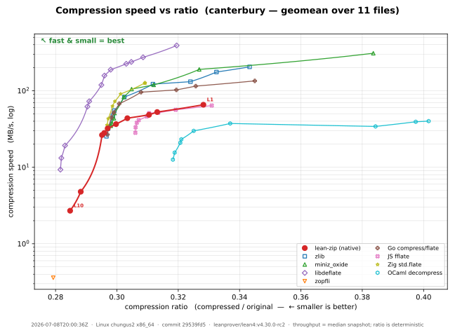
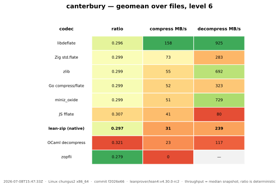
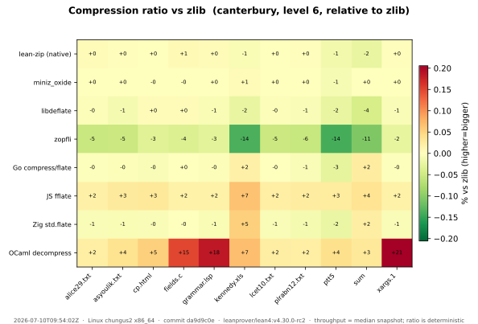
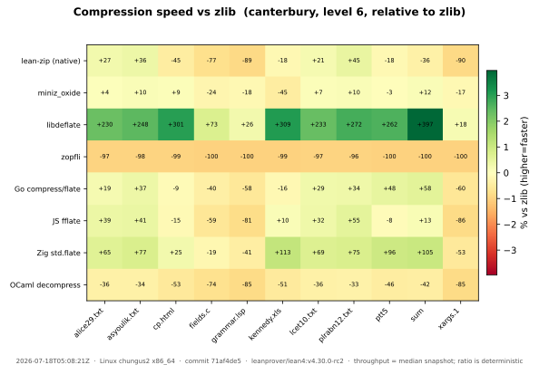
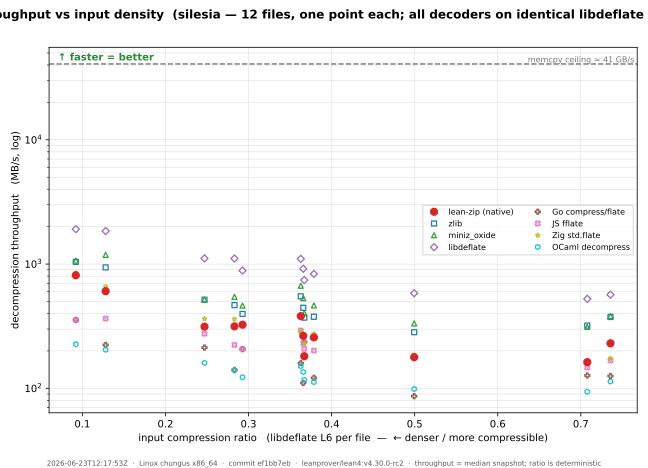
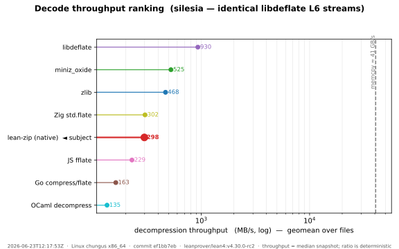
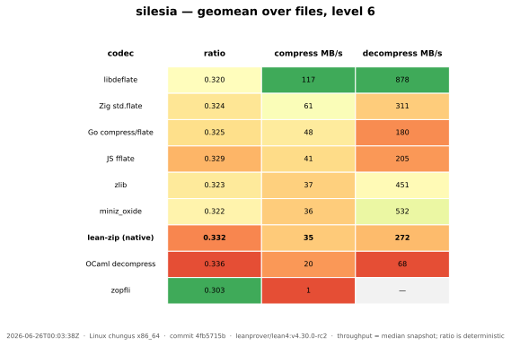
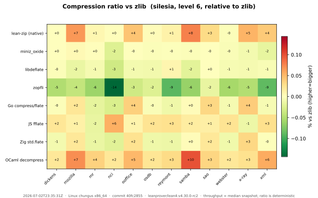
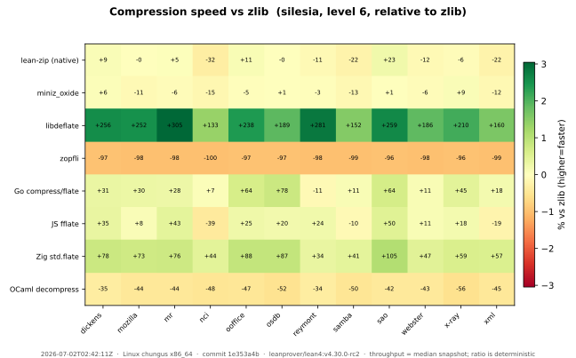

# Track D — benchmark dashboard

Native lean-zip vs. reference implementations, on **compression ratio** and
**throughput**, over the **real compression corpora** across every DEFLATE
level. The graphs are regenerated from committed data by a single command.

> **Real corpora only.** Synthetic patterns were removed (see
> [`../plans/track-d-state.md`](../plans/track-d-state.md), D-18): the pseudo-prose
> pattern was pathologically compressible (200:1) and its decode read ~3800 MB/s
> versus ~106 MB/s on real prose in the *same* run, so it flattered native on
> every axis. The headline numbers now rest entirely on representative data.

```
bench/run.sh        # build + run the matrix, build + run the comparators, render the SVGs
```

That runs [`lake -d bench exe bench-report`](ZipBenchReport.lean) (writes
[`results/latest.json`](results/latest.json) and dumps the exact payloads), then
the external-language comparators (see below), then [`plot.py`](plot.py) (writes
the SVGs). Ratios are deterministic; throughput is a **median-of-5 snapshot of
the machine recorded in the JSON `meta`** — commit the JSON and SVGs together.

> **Benchmark machine: chungus2 (since 2026-07-05).** The canonical machine moved
> from `chungus` to `chungus2`. The two are indistinguishable on throughput —
> within ~0.3% across every version-stable comparator, and byte-identical on ratio
> — so historical numbers stay directly comparable. `go` and `js` each run on
> their **newest** release (`nix-shell -p go` → go 1.26.3; `nodejs_latest` → node
> v26, ~+22% JS compress over the old default v24), so those two curves track the
> compiler version rather than the machine; js in particular carries large V8
> run-to-run variance and is indicative only. Full analysis:
> [`results/cross-machine-chungus-to-chungus2.md`](results/cross-machine-chungus-to-chungus2.md);
> the last `chungus` snapshot is preserved under
> [`results/archive/`](results/archive/) and the comparison is reproducible via
> [`cross_machine.py`](cross_machine.py).

## Compressors compared

The honest comparison group for a pure-Lean codec is other **language-native**
implementations (no SIMD/asm, or GC'd, or JIT'd) — not just the C + SIMD ceiling.

**C / SIMD references and the ratio ceiling**

| Key | Implementation | Role |
|-----|----------------|------|
| `native` | lean-zip pure-Lean DEFLATE | the thing we are improving; swept **levels 1–10** — since #2638 level 9 is the L9-fast tier and level 10 is the exact-DP crown (always sweep through 10 so the crown stays on the Pareto) |
| `zlib` | system zlib (FFI) | the ubiquitous baseline |
| `miniz_oxide` | Rust miniz_oxide (FFI) | widely-used Rust reimplementation |
| `libdeflate` | libdeflate (FFI) | optimized C + SIMD — the runtime speed bar; swept over its full **levels 1–12** (native caps at 10, the zlib/miniz FFI at 9), so its densest points (10–12) appear on the Pareto |
| `zopfli` | zopfli (FFI) | maximum-ratio ceiling — **frozen** (see below); never in the routine matrix |

**Language-native peers** (each a self-verifying CLI under
[`comparators/`](comparators), built by
[`comparators/build_all.sh`](comparators/build_all.sh), timed with the *same*
methodology as the Lean matrix — median-of-5, `itersFor(size)` iters, throughput
vs uncompressed bytes — and run over byte-identical dumped payloads):

| Key | Implementation | Notes |
|-----|----------------|-------|
| `go` | Go stdlib `compress/flate` | pure Go, the mature language-native standard |
| `js` | [`fflate`](https://github.com/101arrowz/fflate) on Node | pure JS on V8's JIT (not node's C-zlib binding) |
| `zig` | Zig stdlib `std.compress.flate` (0.14.1) | pure Zig; **levels 1–3 not implemented upstream** → mapped to the fastest real level, so L1–L4 coincide. 0.15's encoder is an unimplemented `@panic("TODO")`, hence 0.14.1. |
| `ocaml` | [`decompress`](https://github.com/mirage/decompress) (mirage) | pure OCaml, MirageOS pedigree; slightly different LZ77/Huffman ⇒ a hair worse ratio |

zopfli is the maximum-ratio reference, but it is compress-only, level-less, and
~100× slower than zlib — at default iteration count it dominated the wall-clock
of the whole matrix. So it is **not** part of the routine `bench-report` run.
Instead it is a **frozen artifact**, [`results/zopfli-ceiling.json`](results/zopfli-ceiling.json),
generated once and overlaid on the ratio graphs by [`plot.py`](plot.py):

```
# One-time only — do NOT run on every regeneration (very slow). Re-run solely
# if the corpora themselves change:
lake -d bench env bench/.lake/build/bin/bench-report --zopfli-ceiling bench/results/zopfli-ceiling.json
```

Its `ratio`/`out_size` are deterministic (the meaningful signal); its single-rep
`compress_mbps` is an artifact, not a benchmark. A language-native comparator
whose toolchain is unavailable is skipped, so the dashboard degrades gracefully.

## Workloads

The **real compression corpora** from the literature, swept over native levels
1–10 (the level-10 exact crown always included; the zlib/miniz FFI references cap
at 9, `libdeflate` over its full 1–12 — see *Compressors compared*).
Each corpus is a subdirectory of [`corpora/`](corpora); every file in it is one
single-size workload tagged `<corpus>/<file>`, and the harness discovers corpora
by directory (nothing hard-codes Canterbury — a new corpus slots in once its
files land).

- **Canterbury corpus** (11 files, ~2.8 MB: English text, HTML, C and Lisp
  source, an Excel spreadsheet, a fax bitmap, a man page, a SPARC binary),
  committed under [`corpora/canterbury/`](corpora/canterbury) (materialized by
  [`fetch_corpora.sh`](fetch_corpora.sh), verified against recorded SHA-256), so
  CI needs no network.
- **Silesia corpus** (12 files, ~202 MB: prose, UNIX binaries, an HTML
  dictionary, a source tarball, XML, databases, medical images, a DLL) — the
  modern standard zstd/brotli/lzma report against. Fetched on demand into a
  gitignored cache (`fetch_corpora.sh silesia`, pinned GitHub mirror,
  SHA-256-verified); its rows slot into the same per-level charts automatically.
  Because it is ~70× larger than Canterbury, it runs a **reduced matrix** —
  a single timing pass — so the regeneration stays tractable.

The synthetic `prng` pattern used to be the only incompressible workload; its
replacement is **real** poorly-compressible files in the corpora (Silesia `sao`,
`x-ray`, `ooffice`). A near-1.0-ratio point, if wanted, comes from a real
already-compressed file (a JPEG/PDF) — never synthetic noise.

## Graphs

Each corpus gets a layered, corpus-generic set (a new corpus slots in with no
code change). The **headline is the speed-vs-ratio Pareto scatter**: x = ratio
(← smaller is better), y = speed (MB/s, log), and each codec is markers at its
measured levels joined by the **achievable mixing frontier** between adjacent
levels (see *Reading the Pareto* below), so the whole speed/ratio tradeoff reads
at a glance — top-left (fast *and* small) is best, and a dominated codec sits to
the lower-right. Two complements give precise numbers and per-file detail:

- `<corpus>_compress_pareto.svg` — **headline**: compression speed vs ratio,
  codecs as level-curves (replaces the whole per-level bar set).
- `<corpus>_compress_pareto_history.svg` — the headline chart **animated
  through git history** (`bench/pareto_history.py`, run automatically by
  `run.sh`): the reference curves stay fixed at the current data while the
  native curve replays every committed dashboard refresh, one faint trail per
  level. Self-playing SMIL, so it animates inside a README ``. Frames
  that only jitter within throughput noise are dropped, as are stale-branch
  refreshes whose deterministic ratios revert to an already-seen state (see
  the script docstring). `--video` additionally renders an mp4 + GIF (needs
  ffmpeg on PATH), and `--html` an interactive player with a scrubber and
  per-frame commit info; both land in `graphs/` untracked.
- `<corpus>_decode_density.svg` + `<corpus>_decode_ranking.svg` — the
  **decompression analogue** (see *Decoding* below): every decoder timed on
  byte-identical fixed-encoder streams. The density chart is a per-file scatter at
  L6 (x = that file's libdeflate ratio, y = decode MB/s); the ranking chart is the
  precise lollipop ordering, geomean over all encode levels (L1/3/6/9/12) and
  zopfli. Both carry the `memcpy` bandwidth ceiling. Not a Pareto — input density
  is exogenous to the decoder, so the highest band wins.
- `<corpus>_summary.svg` — colour-graded geomean table (ratio / compress /
  decompress per codec, level 6), sorted by speed.
- `<corpus>_ratio_heatmap.svg` / `_compress_heatmap.svg` — per file, relative to
  zlib (red = worse), showing *where* a codec wins or loses without 100 bars.

### Reading the Pareto (the mixing frontier — read this before judging a new tier)

The line between a codec's two adjacent levels is **not** a straight segment. It
is the **mixing curve**: the operating points you can actually reach by
compressing a byte-fraction `f` of the input at the higher level and `1-f` at the
lower one (e.g. per block). That is the real achievable set between two settings
(exact for a single file; the plotted points are per-file geomeans, so between
two geomean dots the curve is a close proxy for the corpus-geomean achievable
set), so it is the honest connector. It joins *adjacent levels* — it is not a
computed global upper envelope, so read it per codec, per neighbouring pair.

The geometry matters, and it is easy to get wrong:

- **Ratio** is additive in bytes, so it is *linear* in `f`.
- **Wall-clock time** is additive, so **1/throughput** is *linear* in `f` —
  throughput itself is not. Throughput is a rate; you average rates by averaging
  their reciprocals (time), never the rates directly.
- Therefore the frontier is a straight line **only** in *(ratio, time-per-byte)*
  space. On the *(ratio, MB/s)* axis it is a curve, and on the **log-MB/s axis
  (what we plot) a straight level-to-level segment sags *above* the true
  frontier** — it overstates the speed reachable at an intermediate ratio. The
  plot draws the correct sagging curve (`_mix_curve` in `plot.py`); trust it, not
  a ruler laid between two dots.

**Consequence for judging incremental progress.** A new operating point is a
genuine improvement — *outside our own frontier* — iff, at its compression ratio,
it is **faster than blending the two bracketing levels** (i.e. it sits *above*
the codec's mixing curve at that ratio). Equivalently: interpolate the two
adjacent levels to the new point's ratio; if that mix is slower, the new point is
a real Pareto gain. Judging "inside/outside" by eye against the straight segment
on the log axis is wrong and will reject real wins — this bit us once (issue
#2638 measurement). To check it numerically, compare in **seconds-per-MiB
(`1/throughput`)**, not MB/s:

    f       = (ratio_lo − ratio_new) / (ratio_lo − ratio_hi)   # 0 at lo … 1 at hi
    t_mix   = (1 − f)/mbps_lo + f/mbps_hi                       # s per MiB of the mix
    outside = (1/mbps_new) < t_mix                              # new point faster at equal ratio

**This is a within-codec test, and it is the bar for "did we make progress".** It
is *not* the same as beating the C+SIMD references. libdeflate and zopfli set the
absolute ratio/speed *ceiling* (the reference band), not the bar for our own
incremental work: a change that pushes a point outside *our* mixing curve is
progress even while the references remain ahead. Do not gate our own Pareto
improvements on catching a SIMD C codec. (Cross-codec comparison still matters —
as context, and for justifying a *new tier's* external reason to exist — it just
is not the pass/fail test for an incremental within-native gain.)

### Canterbury corpus (11 small files, native levels 1–10; libdeflate 1–12)






### Silesia corpus (12 large files, native levels 1–10; libdeflate 1–12)









## Decoding (decode-density)

The compress headline is a *speed-vs-ratio Pareto* because each codec chooses its
own ratio/speed tradeoff. Decompression has no such tradeoff: the input density is
**exogenous** — a property of the stream, not the decoder's choice. So the decode
charts measure **decode throughput vs input density**, with every decoder on
*byte-identical* input (only possible because DEFLATE is one interoperable format
— you genuinely can feed one encoder's stream to every decoder). The fixed encoder
is **libdeflate** (raw DEFLATE, the densest realistic streams); `memcpy` is the
memory-bandwidth ceiling on emitting the output bytes. This is the rigorous way to
isolate a decoder: an own-encoder scatter (the lzbench / Squash convention)
confounds decoder speed with each encoder's ratio.

The native row here is the **known-exact-size production path** — the same one
ZIP extraction runs (`Zip.Archive` decodes each entry at its declared
`uncompressedSize`). The decode-density harness feeds the decoder the stream's
true output size, so native decodes through
`Zip.Native.Inflate.inflateSized … (exact := true)`: the verified branch-free
`uset` exact-size fastloop that writes every byte once into the pre-extended
buffer, dropping the per-literal capacity and output-size checks. It is proven
byte-identical to the push decoder `inflate` (`inflateSized_agrees`), so the
measured throughput is the production fast path, not a benchmark-only shortcut.

Two views over the fixed-encoder streams — libdeflate at levels 1/3/6/9/12 plus a
zopfli stream per file (the densest realistic raw DEFLATE):

- **`<corpus>_decode_density.svg`** — per-file scatter at a single representative
  level (libdeflate L6): x = each file's compression ratio (wide, from ~0.27 text
  to ~0.9 incompressible like `sao` / `x-ray`), y = decode MB/s. Shows
  content-dependence — literal-heavy incompressible data decodes differently than
  match-heavy text.
- **`<corpus>_decode_ranking.svg`** — lollipop of geomean decode MB/s per decoder,
  one number each, the geomean taken over **every** stream (all five libdeflate
  levels and zopfli, each file) so the ranking spans the full input-density range
  rather than one encode level. The memcpy ceiling shows the headroom.

Pipeline (wired into `bench/run.sh` step 3b):

```
# 1. dump the fixed-encoder streams for Silesia (libdeflate L1/3/6/9/12 + zopfli)
#    + time the in-process decoders + memcpy. Streams are cached under the dir
#    below and reused across runs — a stream is (re)encoded only when missing, so
#    the slow zopfli pass is paid once.
lake -d bench env bench/.lake/build/bin/bench-report --decode-density \
  bench/results/decode_density.json bench/payloads-deflate
# 2. time the external decoders (Go / JS / Zig / OCaml) on the same streams
python3 bench/decode_density.py bench/payloads-deflate bench/results/decode_density.json
# 3. plot.py auto-detects decode_density.json → graphs/<corpus>_decode_{density,ranking}.svg
```

Each comparator gains a `decode <stream.deflate>` mode (alongside its existing
`<payload> <level>` roundtrip mode) so it decodes a provided stream with the same
median-of-5 / `itersFor` methodology as the Lean side. The streams under
`bench/payloads-deflate/` are gitignored and act as a semi-permanent cache
(regenerated only when a stream is missing); `decode_density.json` is committed
alongside `latest.json`.

### Profiling the decoder

`--decode-density` sweeps *all five* decoders over all of Silesia, so a `perf`
of that process is a blur of native + zlib + miniz + libdeflate + memcpy. To
attribute cost to native inflate alone, use the single-decoder driver
[`inflate-profile`](ZipInflateProfile.lean) — its `decode` mode's steady-state
loop calls **only** `Zip.Native.Inflate.inflate` over one payload, so no other
decoder shows up in the profile (the binary links libdeflate for `compress` mode,
but that code never runs in a `decode` pass):

```
# 1. dump one libdeflate raw-DEFLATE payload (levels 1–12; note the origSize it prints)
lake -d bench build inflate-profile
lake -d bench env bench/.lake/build/bin/inflate-profile \
  compress bench/corpora/silesia/dickens /tmp/dickens.deflate 6
# → "origSize for decode = 10192446" (the decompressed length = the sizeHint)

# 2a. sample the hot loops (call graph). Pick reps so the run is a few seconds.
#     Lean/C is compiled without frame pointers, so use DWARF unwinding for
#     accurate call graphs (`-g` / --call-graph fp gives broken stacks here).
lake -d bench env perf record --call-graph dwarf -- \
  bench/.lake/build/bin/inflate-profile decode /tmp/dickens.deflate 10192446 2000
perf report                    # interactive; the hot loop is inflateLoopTreeFree
# annotate a symbol (perf shows mangled names — grep the binary for the real string:
#   nm bench/.lake/build/bin/inflate-profile | grep inflateLoopTreeFree)
lake -d bench env perf annotate -- lp_lean_x2dzip_Zip_Native_Inflate_inflateLoopTreeFree

# 2b. hardware counters (IPC, branch + cache behaviour) over the same run
lake -d bench env perf stat -e cycles,instructions,branches,branch-misses,\
cache-references,cache-misses -- \
  bench/.lake/build/bin/inflate-profile decode /tmp/dickens.deflate 10192446 2000
```

The driver re-invokes inflate fresh every rep (never binding the result once and
reusing it) and consumes each result through a `noinline` sink, so no decode is
hoisted or dropped — wall-clock scales linearly with `reps`, as it must for
`perf` to accumulate samples in the real hot loops.

**Same-worktree A/B rule (from
[#2630](https://github.com/kim-em/lean-zip/issues/2630) — this bites).** When
comparing a decode change against its baseline, build **both** commits in the
**same** worktree and profile the two saved binaries. A baseline built in a
*separate* worktree is not code-layout-comparable: the two embed different
absolute paths and can link objects into a different layout, shifting i-cache
alignment of the hot loops and producing a uniform ~5–15% offset across the
board — a pure artifact that survives interleaving and masquerades as a real
delta. `git checkout <parent>`, `lake -d bench build inflate-profile`, copy the
binary aside; `git checkout` back, rebuild, copy aside; then A/B the two saved
binaries. Untouched code paths must overlay to within ~1%; a uniform offset is
the worktree, not your change.

**Write-once cursor spike (#2799).** `inflate-profile` also has two spike modes,
`decode-fast` (the `set!` cursor `Inflate.inflateFast`) and `decode-fast-u` (the
branch-free `uset` fastloop `Inflate.inflateFastU`), plus `decode-ld` (libdeflate's
own decompressor as the absolute speed bar), all with the same
`<payload> <origSize> <reps>` arguments. They exercise the write-once cursor
decode from `Zip/Native/InflateFast.lean` (exact-size path — `origSize` must be
the true decompressed length), and each asserts its output equals the reference
`Inflate.inflate` once before the timed loop. Every mode now prints absolute
throughput (MB/s over the decompressed bytes, only the loop timed), so a
best-of-5 sweep gives end-to-end decode rates directly. Because all modes live in
one binary, an A/B across `decode` / `decode-fast` / `decode-fast-u` is strictly
more layout-comparable than the two-worktree rule above — no separate builds.
Build with libdeflate enabled (`nix-shell` already lists it) for `compress` /
`decode-ld`: `LIBDEFLATE_LDFLAGS=-ldeflate lake -R -d bench build inflate-profile`.
The #2799 verdict from this A/B is recorded in `plans/track-d-state.md`.

## What the current snapshot shows

> On real data (Canterbury, level 6, geomean over 11 files) native is the
> **worst real codec on all three axes** — ratio 0.323 (zlib 0.299), compress
> 10 MB/s (zlib 55), decompress 92 MB/s (zlib 696) — with the ratio gap
> **largest on big prose** (`plrabn12` +30%, `lcet10` +24% vs zlib). Those two
> findings drive the Track D backlog.

- **Ratio.** Native trails every real codec; the gap is small on
  short/structured files but large on big prose (`plrabn12.txt` 0.525 vs zlib's
  0.405). The language-native peers land within a hair; only OCaml `decompress`
  gives up a little ratio (different LZ77/Huffman). zopfli is the floor (0.279).
- **Compression speed is the gap — but it's a language-native gap, not a chasm.**
  Throughput stratifies by implementation maturity: libdeflate (C+SIMD) on top,
  then Zig / miniz_oxide, then Go / zlib, then the JIT'd JS, then OCaml, then
  `native`. lean-zip is in the pack and at the back, but the distance to the
  *other pure-language* codecs is a small single-digit factor, not the
  order-of-magnitude that the C+SIMD ceiling alone suggests.
- **Decompression is behind too on real data** — native ~94 MB/s vs zlib ~692
  (≈7×) on Canterbury, ~100 vs ~365 (≈4×) on Silesia. (The earlier "competitive"
  read came from the synthetic match-heavy text, which decoded as near-pure
  memcpy; real, literal-heavy data exposes the per-symbol Huffman decode path.)

These observations drive the optimization backlog in
[`../plans/track-d-state.md`](../plans/track-d-state.md).
