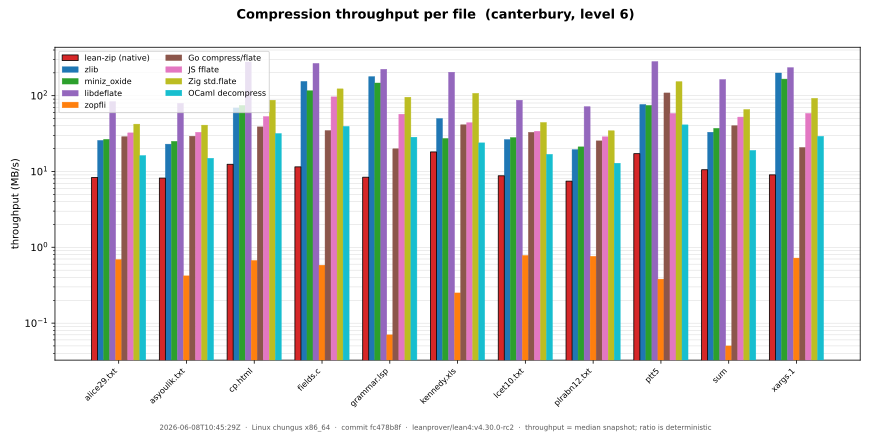
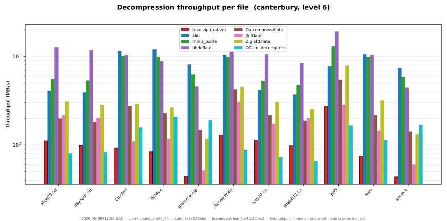
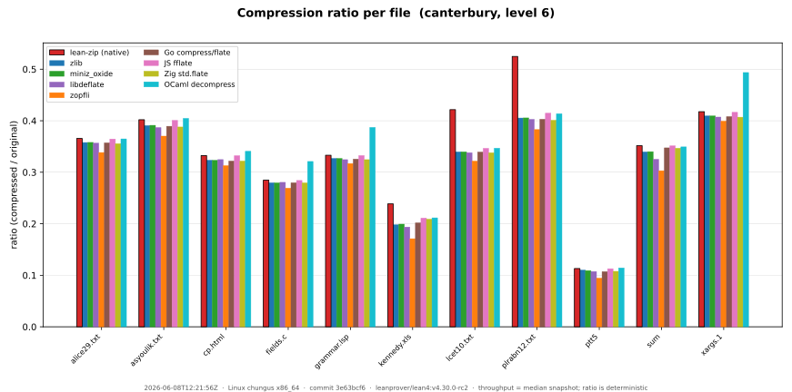
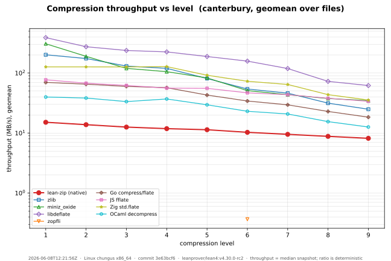
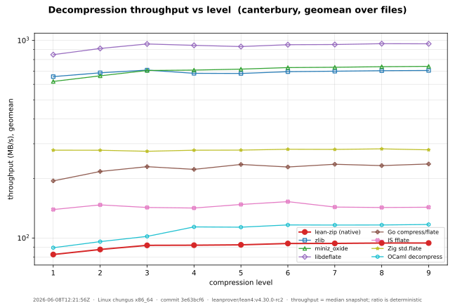
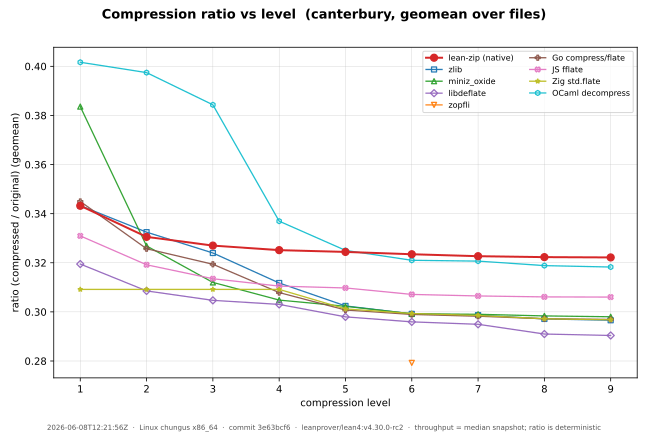

# Track D — benchmark dashboard

Native lean-zip vs. reference implementations, on **compression ratio** and
**throughput**, over the **real compression corpora** across every DEFLATE
level. The graphs are regenerated from committed data by a single command.

> **Real corpora only.** Synthetic patterns were removed (see
> [`../plans/track-d-state.md`](../plans/track-d-state.md), D-18): the pseudo-prose
> pattern was pathologically compressible (200:1) and its decode read ~3800 MB/s
> versus ~106 MB/s on real prose in the *same* run, so it flattered native on
> every axis. The headline numbers now rest entirely on representative data.

```
bench/run.sh        # build + run the matrix, build + run the comparators, render the SVGs
```

That runs [`lake exe bench-report`](../ZipBenchReport.lean) (writes
[`results/latest.json`](results/latest.json) and dumps the exact payloads), then
the external-language comparators (see below), then [`plot.py`](plot.py) (writes
the SVGs). Ratios are deterministic; throughput is a **median-of-5 snapshot of
the machine recorded in the JSON `meta`** — commit the JSON and SVGs together.

## Compressors compared

The honest comparison group for a pure-Lean codec is other **language-native**
implementations (no SIMD/asm, or GC'd, or JIT'd) — not just the C + SIMD ceiling.

**C / SIMD references and the ratio ceiling**

| Key | Implementation | Role |
|-----|----------------|------|
| `native` | lean-zip pure-Lean DEFLATE | the thing we are improving |
| `zlib` | system zlib (FFI) | the ubiquitous baseline |
| `miniz_oxide` | Rust miniz_oxide (FFI) | widely-used Rust reimplementation |
| `libdeflate` | libdeflate (FFI) | optimized C + SIMD — the runtime speed bar |
| `zopfli` | zopfli (FFI) | maximum-ratio ceiling (compress-only, slow) |

**Language-native peers** (each a self-verifying CLI under
[`comparators/`](comparators), built by
[`comparators/build_all.sh`](comparators/build_all.sh), timed with the *same*
methodology as the Lean matrix — median-of-5, `itersFor(size)` iters, throughput
vs uncompressed bytes — and run over byte-identical dumped payloads):

| Key | Implementation | Notes |
|-----|----------------|-------|
| `go` | Go stdlib `compress/flate` | pure Go, the mature language-native standard |
| `js` | [`fflate`](https://github.com/101arrowz/fflate) on Node | pure JS on V8's JIT (not node's C-zlib binding) |
| `zig` | Zig stdlib `std.compress.flate` (0.14.1) | pure Zig; **levels 1–3 not implemented upstream** → mapped to the fastest real level, so L1–L4 coincide. 0.15's encoder is an unimplemented `@panic("TODO")`, hence 0.14.1. |
| `ocaml` | [`decompress`](https://github.com/mirage/decompress) (mirage) | pure OCaml, MirageOS pedigree; slightly different LZ77/Huffman ⇒ a hair worse ratio |

zopfli runs a reduced grid (one level, capped at 256 KiB, single rep): it is the
ratio *floor*, not a throughput contender. A comparator whose toolchain is
unavailable is skipped, so the dashboard degrades gracefully.

## Workloads

The **real compression corpora** from the literature, swept over levels 1–9.
Each corpus is a subdirectory of [`corpora/`](corpora); every file in it is one
single-size workload tagged `<corpus>/<file>`, and the harness discovers corpora
by directory (nothing hard-codes Canterbury — a new corpus slots in once its
files land).

- **Canterbury corpus** (11 files, ~2.8 MB: English text, HTML, C and Lisp
  source, an Excel spreadsheet, a fax bitmap, a man page, a SPARC binary),
  committed under [`corpora/canterbury/`](corpora/canterbury) (materialized by
  [`fetch_corpora.sh`](fetch_corpora.sh), verified against recorded SHA-256), so
  CI needs no network. zopfli runs at level 6 only (small corpus, slow).
- **Silesia corpus** (12 files, ~202 MB: prose, UNIX binaries, an HTML
  dictionary, a source tarball, XML, databases, medical images, a DLL) — the
  modern standard zstd/brotli/lzma report against. Fetched on demand into a
  gitignored cache (`fetch_corpora.sh silesia`, pinned GitHub mirror,
  SHA-256-verified); its rows slot into the same per-level charts automatically.
  Because it is ~70× larger than Canterbury, it runs a **reduced matrix** —
  levels [1, 6, 9], a single timing pass, zopfli skipped — so the regeneration
  stays tractable.

The synthetic `prng` pattern used to be the only incompressible workload; its
replacement is **real** poorly-compressible files in the corpora (Silesia `sao`,
`x-ray`, `ooffice`). A near-1.0-ratio point, if wanted, comes from a real
already-compressed file (a JPEG/PDF) — never synthetic noise.

## Graphs

Charts are corpus-generic: each corpus gets its own set, and the per-level set
follows whatever levels the report timed. Filenames:

- `<corpus>_compress_throughput.svg`, `_decompress_throughput.svg`, `_ratio.svg`
  — per-file grouped bars at level 6 (one x-tick per file, one bar per
  compressor); the stable filenames embedded below.
- `<corpus>_<metric>_L<n>.svg` — the same grouped bars at each timed level n.
- `<corpus>_<metric>_vs_level.svg` — aggregate line chart, geomean over the
  corpus files, one line per compressor, across levels.

### Canterbury corpus (real data, per file, level 6)





### Canterbury — aggregate vs level (geomean over files)





Per-level per-file bars (one figure each, levels 1–9):
compress
[L1](graphs/canterbury_compress_throughput_L1.svg) ·
[L2](graphs/canterbury_compress_throughput_L2.svg) ·
[L3](graphs/canterbury_compress_throughput_L3.svg) ·
[L4](graphs/canterbury_compress_throughput_L4.svg) ·
[L5](graphs/canterbury_compress_throughput_L5.svg) ·
[L6](graphs/canterbury_compress_throughput_L6.svg) ·
[L7](graphs/canterbury_compress_throughput_L7.svg) ·
[L8](graphs/canterbury_compress_throughput_L8.svg) ·
[L9](graphs/canterbury_compress_throughput_L9.svg);
decompress
[L1](graphs/canterbury_decompress_throughput_L1.svg) ·
[L2](graphs/canterbury_decompress_throughput_L2.svg) ·
[L3](graphs/canterbury_decompress_throughput_L3.svg) ·
[L4](graphs/canterbury_decompress_throughput_L4.svg) ·
[L5](graphs/canterbury_decompress_throughput_L5.svg) ·
[L6](graphs/canterbury_decompress_throughput_L6.svg) ·
[L7](graphs/canterbury_decompress_throughput_L7.svg) ·
[L8](graphs/canterbury_decompress_throughput_L8.svg) ·
[L9](graphs/canterbury_decompress_throughput_L9.svg);
ratio
[L1](graphs/canterbury_ratio_L1.svg) ·
[L2](graphs/canterbury_ratio_L2.svg) ·
[L3](graphs/canterbury_ratio_L3.svg) ·
[L4](graphs/canterbury_ratio_L4.svg) ·
[L5](graphs/canterbury_ratio_L5.svg) ·
[L6](graphs/canterbury_ratio_L6.svg) ·
[L7](graphs/canterbury_ratio_L7.svg) ·
[L8](graphs/canterbury_ratio_L8.svg) ·
[L9](graphs/canterbury_ratio_L9.svg).

## What the current snapshot shows

> On real data (Canterbury, level 6, geomean over 11 files) native is the
> **worst real codec on all three axes** — ratio 0.323 (zlib 0.299), compress
> 10 MB/s (zlib 55), decompress 92 MB/s (zlib 696) — with the ratio gap
> **largest on big prose** (`plrabn12` +30%, `lcet10` +24% vs zlib). Those two
> findings drive the Track D backlog.

- **Ratio.** Native trails every real codec; the gap is small on
  short/structured files but large on big prose (`plrabn12.txt` 0.525 vs zlib's
  0.405). The language-native peers land within a hair; only OCaml `decompress`
  gives up a little ratio (different LZ77/Huffman). zopfli is the floor (0.279).
- **Compression speed is the gap — but it's a language-native gap, not a chasm.**
  Throughput stratifies by implementation maturity: libdeflate (C+SIMD) on top,
  then Zig / miniz_oxide, then Go / zlib, then the JIT'd JS, then OCaml, then
  `native`. lean-zip is in the pack and at the back, but the distance to the
  *other pure-language* codecs is a small single-digit factor, not the
  order-of-magnitude that the C+SIMD ceiling alone suggests.
- **Decompression** is competitive — native inflate runs in the hundreds of
  MB/s, the same order as zlib.

These observations drive the optimization backlog in
[`../plans/track-d-state.md`](../plans/track-d-state.md).
