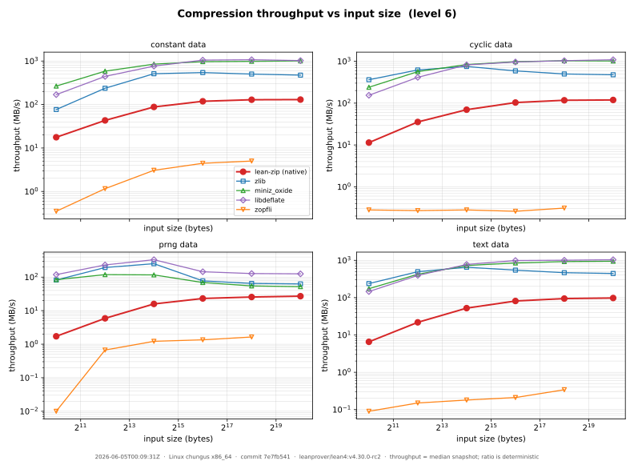
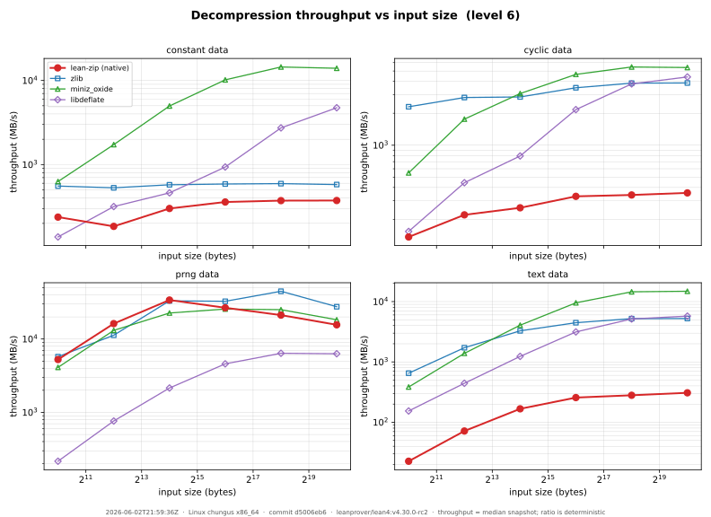
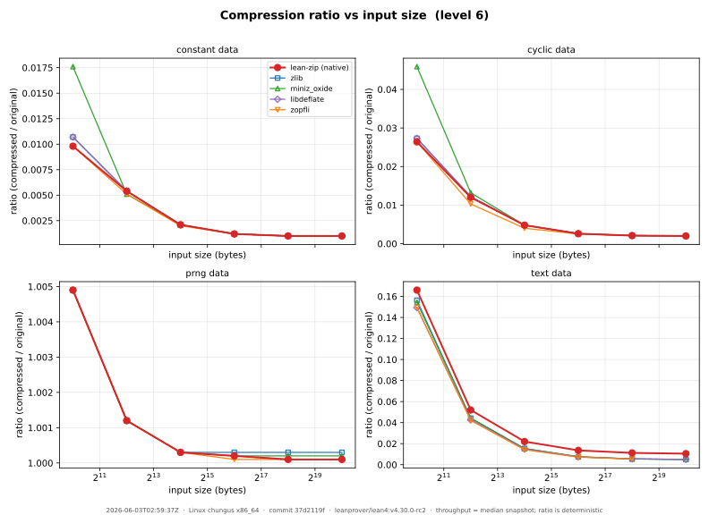
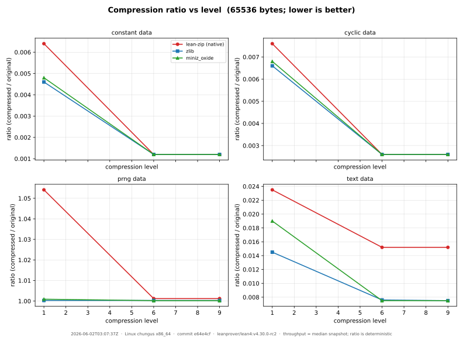

# Track D — benchmark dashboard

Native lean-zip vs. reference implementations, on **compression ratio** and
**throughput**, across data patterns × sizes × levels. The graphs use log scales
and are regenerated from committed data by a single command.

```
bench/run.sh        # build + run the matrix, then render the SVGs
```

That runs [`lake exe bench-report`](../ZipBenchReport.lean) (writes
[`results/latest.json`](results/latest.json)) and then
[`plot.py`](plot.py) (writes the SVGs below). Ratios are deterministic;
throughput is a **median-of-5 snapshot of the machine recorded in the JSON
`meta`** — commit the JSON and SVGs together.

## Compressors compared

| Key | Implementation | Role |
|-----|----------------|------|
| `native` | lean-zip pure-Lean DEFLATE | the thing we are improving |
| `zlib` | system zlib (FFI) | the ubiquitous baseline |
| `miniz_oxide` | Rust miniz_oxide (FFI) | widely-used Rust reimplementation |
| `libdeflate` | libdeflate (FFI) | optimized C, the speed bar *(landing next)* |
| `zopfli` | zopfli (FFI) | maximum-ratio ceiling *(landing next)* |

## Graphs

### Compression throughput vs input size


### Decompression throughput vs input size


### Compression ratio vs input size


### Compression ratio vs level


## What the current snapshot shows

- **Decompression** is competitive — native inflate runs in the hundreds of
  MB/s, the same order as zlib.
- **Compression is the gap**: native deflate is roughly an order of magnitude
  slower than zlib/miniz_oxide across every pattern and size.
- **Ratio** is close to the references on highly-compressible data, but native
  leaves measurable ground on `text` and has worse small-input overhead on
  incompressible (`prng`) data.

These observations drive the optimization backlog in
[`../plans/track-d-state.md`](../plans/track-d-state.md).
