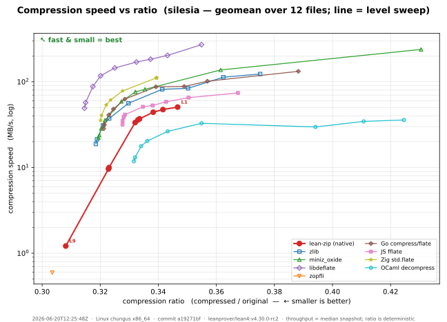

# Why Lean is faster than Rust

I can't possibly be serious, can I, claiming that Lean is faster than Rust?

Let me show you something:

```shell
# silesia.tar: the 212 MB standard corpus. Each tool compresses at level 6
# and prints the resulting size in bytes; `time` reports wall-clock.
$ time deflate-rust silesia.tar   # miniz_oxide (Rust)
68112444
real    0m5.75s

$ time deflate-lean silesia.tar   # lean-zip
67944300
real    0m5.67s
```

What's going on here? This is the [`lean-zip`](https://github.com/kim-em/lean-zip) implementation of [`DEFLATE`](https://www.rfc-editor.org/rfc/rfc1951)
compressing the standard [`silesia`](https://github.com/MiloszKrajewski/SilesiaCorpus) compression benchmarking corpus,
**faster** and **better** than [`miniz_oxide`](https://github.com/Frommi/miniz_oxide), the standard pure-Rust implementation.

How is that even remotely possible? The secret is this:

```lean
/-- Unified DEFLATE roundtrip: inflating what we deflate returns the input exactly. -/
theorem inflate_deflateRaw (data : ByteArray) (level : UInt8)
    (maxOutputSize : Nat) (hsize : data.size ≤ maxOutputSize) :
    inflate (deflateRaw data level) maxOutputSize = .ok data
```

The Lean library isn't just tested and validated, it's proved correct. This allows us to let AIs loose optimizing the code, requiring that they update the proof whenever the implementation materially changes. This gives us the confidence to allow them to work autonomously in a way that would be unthinkable in other languages.

What comes out of this process is astonishing.



These graphs show the "Pareto frontier", describing the compression ratio vs throughput tradeoff for the `lean-zip` and `miniz_oxide` implementations. Like all zip implementations, both libraries have a tunable knob (the "level") that gives better compression in exchange for lower throughput. The way these graphs are set up, further left is better compression, further up is better throughput. The green line shows what you get as you sweep through the levels using `miniz_oxide`, compressing the `silesia corpus`. The animated red line shows what you get for `lean-zip`, over the course of the autonomous optimization process (using a combination of Claude and Codex agents).

(Note these graphs are measuring the geometric mean of the compression ratios across the constituent files in `silesia.tar`, so it's a slightly different measurement than the our first one.)

We're not nearly as fast as `miniz_oxide`'s L1 (the least compression, fastest throughput setting). For `miniz_oxide`'s L2-L5, at the corresponding compression ratio we're a bit slower (worst is L4, 28% slower). But then for L6-L9, `miniz_oxide` is dominated: `lean-zip` is capable of compressing faster and better. The headline numbers in this post are taken from L6, the typical default for zip algorithms. At `miniz_oxide`'s L9 we're a full 58% faster.

I still can't quite believe that!

You might say, of course "well, no one has tried running these agents on `miniz_oxide`, trying to optimize it in the same way". And this is certainly fair: I'm sure we could improve the performance! But would we trust it? Are the AIs introducing subtle bugs that aren't picked up by the current test suites? We'd have to carefully audit and review everything it suggests. But on the Lean side we just shrug and say "`inflate (deflateRaw data level) = .ok data` still holds, so I guess it's fine".

For completeness, here's the Pareto frontier graph showing a number of other DEFLATE libraries:



`lean-zip` is certainly not the best here: `libdeflate` unsurprisingly blows it out of the water (unsurprisingly because this is a very carefully tuned implementation using architecture-specifical SIMD, that we can't touch in Lean). But ... we're competitive with or simply better than every other library out there. (We completely dominate the OCaml and Javascript implementations, lose at lower levels but win at high levels against Go, Rust, Zig, and the reference `zlib` implementation in C, and are dominated by `libdeflate`).

There are also some caveats that are worth thinking about:
* The Lean implementation has higher memory consumption that the Rust implementation.
* There are some trust gaps because we use Lean's `@[extern]` annotation
to provide a few low-level functions (e.g. word-sized reads from a `ByteArray`) that are currently missing from the Lean runtime. We're pushing Lean's readiness as a general purpose programming language, so these will probably be added to the runtime soon.
* Proving that our implementation round-trips, produces a valid DEFLATE stream, and accepts any valid stream, is a good start, but doesn't address other interesting questions, e.g. absence of side channels or verified performance guarantees.

I'm not **really** claiming that "Lean is faster than Rust". It's still much easier to sit down and produce a performant implementation in Rust than it is in Lean!
This experiment merely shows that:
* It is possible, with lots of effort tuning, to get basic algorithms written in Lean competitive with implementations in "fast" languages.
* That effort is happily and surprisingly delegatable to AIs, when you can write theorems characterising the algorithm, allowing aggressive optimization without human review.

Still, food for thought.
